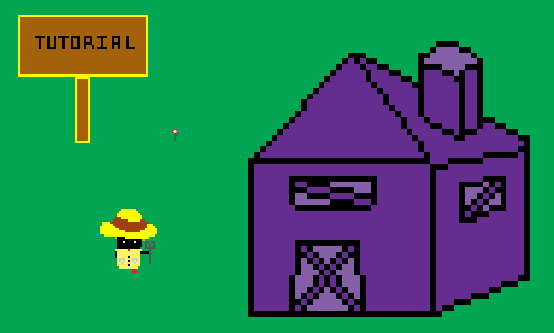
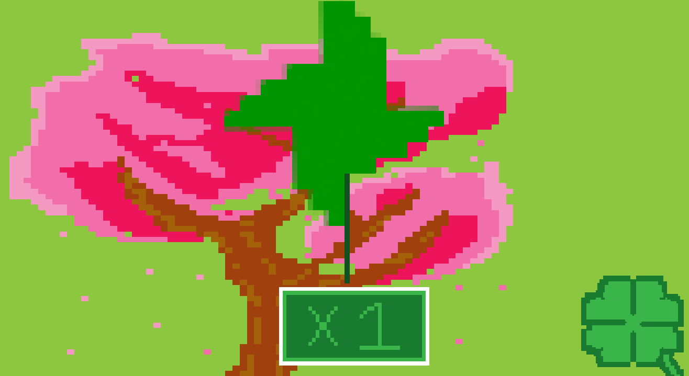
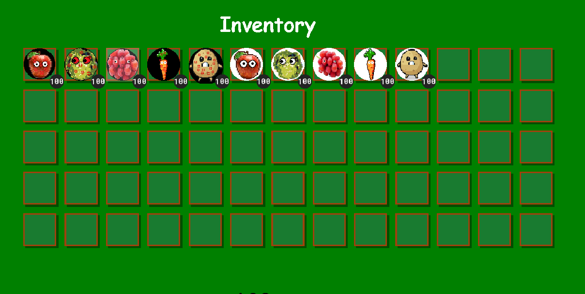
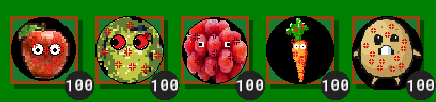
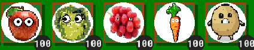
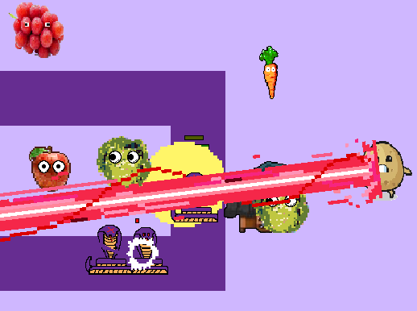
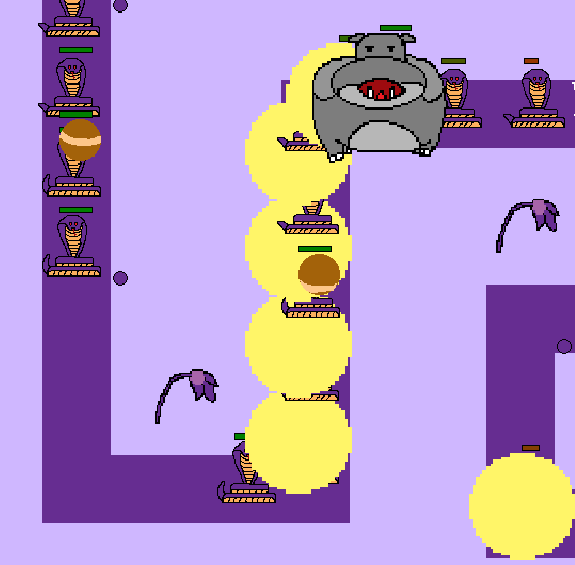
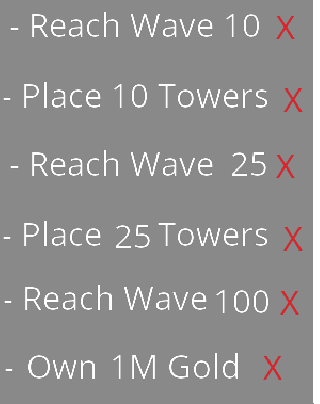

## How to Start
First, install the Gamemaker Application. Next, follow the System Manual to successfully upload the game onto Gamemaker. Once everything is uploaded, the game will run when the play button is pressed inside Gamemaker.
## Game Features
**Player**

There is a controllable character (arrow keys) that is used to move the player across different stages.

**Gacha**

The gacha system can be accessed through the clover, which is attached to the shop button. The gacha machine will give the player either a power-up or power point for the towers. The gacha machine is FREE.

**Inventory**

The inventory system can be accessed through "I" key on the keyboard. It will store power-ups and powerpoints.

**Power-up**

Each tower will have a power-up that can either help or not help the player. They are shaded black in the inventory.

**Powerpoints/Gold**

These are currency used to upgrade towers.

**Towers/Upgrades**

There are 5 towers that can be placed on appropiate tiles and sold. Each tower can be upgraded with gold and power points. Once a tower reaches level 5, it will have a special upgrade.

**Monsters**

There are monsters with different unique abilties that the player must beware of, including invicibility. There is a boss monster with a lot more health points. For example, when the armadillo is rolling, every monster is invincible.

**Achievements**

The achievement panel can be accessed through the star button in the game. Achievements will glow up once they are achieved.
